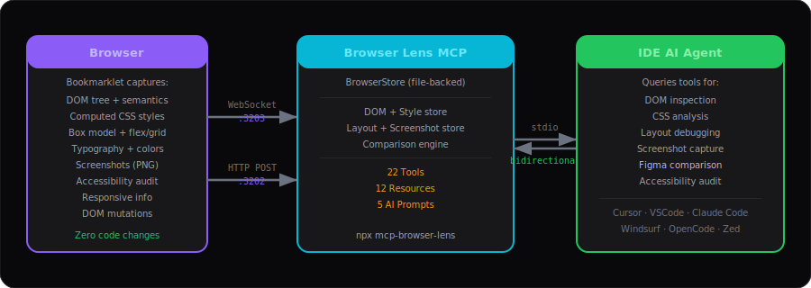
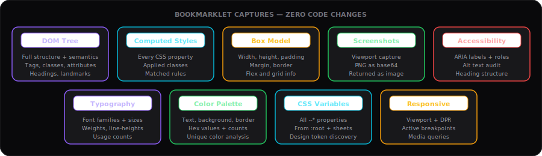
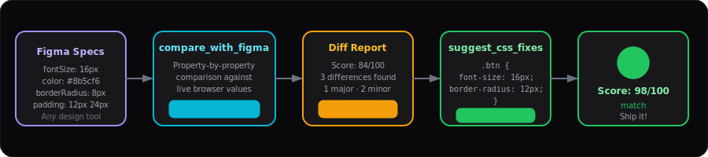

<div align="center">
  
  <h1>mcp-browser-lens</h1>
  <p><strong>Your browser's UI, deeply understood by your IDE's AI agent.</strong></p>
  <p>
    <a href="https://www.npmjs.com/package/browser-lens-mcp"></a>
    <a href="https://www.npmjs.com/package/browser-lens-mcp"></a>
    <a href="https://modelcontextprotocol.io"></a>
    <a href="https://nodejs.org"></a>
    <a href="LICENSE"></a>
  </p>
</div>

---

## How It Works

Browser Lens connects your IDE's AI agent to any running web page through a lightweight bookmarklet. No browser extensions, no code changes, no build step — just click and inspect.

<div align="center">
  
</div>

**The flow:**

1. **Bookmarklet** runs in your browser, capturing DOM, CSS, layout, screenshots, and more
2. **WebSocket** streams data in real-time to the Browser Lens MCP server (`:3203`)
3. **MCP server** stores and indexes everything, exposes 22 tools, 12 resources, 5 prompts
4. **IDE AI agent** queries tools via stdio to inspect, compare, and fix your UI

---

## What Gets Captured

<div align="center">
  
</div>

| Category | Data | Details |
|----------|------|---------|
| **DOM** | Full tree + element details | Tags, classes, attributes, text, semantic structure, headings, landmarks |
| **CSS** | Computed styles | Every CSS property for any element, applied classes, matched rules |
| **CSS** | Variables | All `--*` custom properties from `:root` and stylesheets |
| **CSS** | Typography | Font families, sizes, weights, line-heights — grouped with usage counts |
| **CSS** | Colors | Text, background, border colors with hex values and occurrence counts |
| **Layout** | Box model | Width, height, padding, margin, border, content dimensions |
| **Layout** | Flex & Grid | Direction, wrap, gap, template columns/rows, child positioning |
| **Layout** | Spacing | Margin/padding analysis across elements, spacing scale, inconsistencies |
| **Visual** | Screenshots | Viewport capture as PNG (base64), returned directly as image to IDE |
| **Visual** | Figma comparison | Compare any element against design specs — score + per-property diff |
| **A11y** | Accessibility | ARIA labels, roles, alt text, heading levels, landmarks, issues |
| **Responsive** | Viewport | Dimensions, device pixel ratio, active media queries, breakpoint status |
| **Mutations** | DOM changes | Attribute modifications, added/removed nodes — real-time via MutationObserver |

---

## Quick Start

### Step 1 — Configure your IDE

<details open>
<summary><strong>Cursor</strong></summary>

**File:** `.cursor/mcp.json` (project) or `~/.cursor/mcp.json` (global)

```json
{
  "mcpServers": {
    "mcp-browser-lens": {
      "command": "npx",
      "args": ["-y", "browser-lens-mcp@latest"]
    }
  }
}
```
</details>

<details>
<summary><strong>VS Code (Copilot)</strong></summary>

**File:** `.vscode/mcp.json` (project) or User Settings (global)

```json
{
  "servers": {
    "mcp-browser-lens": {
      "type": "stdio",
      "command": "npx",
      "args": ["-y", "browser-lens-mcp@latest"]
    }
  }
}
```
</details>

<details>
<summary><strong>Claude Code (Anthropic)</strong></summary>

**Run once** — adds to `~/.claude.json`:

```bash
claude mcp add mcp-browser-lens npx -y browser-lens-mcp@latest
```
</details>

<details>
<summary><strong>Windsurf (Codeium)</strong></summary>

**File:** `~/.codeium/windsurf/mcp_config.json`

```json
{
  "mcpServers": {
    "mcp-browser-lens": {
      "command": "npx",
      "args": ["-y", "browser-lens-mcp@latest"]
    }
  }
}
```
</details>

<details>
<summary><strong>OpenCode</strong></summary>

**File:** `.opencode/config.json` or `~/.config/opencode/config.json`

```json
{
  "mcpServers": {
    "mcp-browser-lens": {
      "command": "npx",
      "args": ["-y", "browser-lens-mcp@latest"]
    }
  }
}
```
</details>

<details>
<summary><strong>Zed</strong></summary>

**File:** `~/.config/zed/settings.json`

```json
{
  "context_servers": {
    "mcp-browser-lens": {
      "command": {
        "path": "npx",
        "args": ["-y", "browser-lens-mcp@latest"]
      }
    }
  }
}
```
</details>

<details>
<summary><strong>Any MCP-compatible client</strong></summary>

The server communicates via **stdio** transport. Run:

```bash
npx browser-lens-mcp@latest
```

Connect your MCP client to the process stdin/stdout.
</details>

### Step 2 — Connect your browser

1. Open **http://localhost:3202** in your browser
2. **Drag** the bookmarklet to your bookmarks bar
3. Navigate to any web app
4. **Click** the bookmarklet — you'll see in the console:

```
[Browser Lens] WebSocket connected
[Browser Lens] Connected! DOM, CSS, layout, and visual data streaming to IDE.
```

### Step 3 — Ask your AI agent

```
@mcp-browser-lens Describe this page's UI layout and structure
@mcp-browser-lens Compare .hero-button with Figma: fontSize 16px, fontWeight 600, backgroundColor #8b5cf6
@mcp-browser-lens Take a screenshot and audit the design
@mcp-browser-lens What CSS variables are defined on this page?
@mcp-browser-lens Show me all accessibility issues
@mcp-browser-lens Suggest CSS fixes for the last comparison
```

---

## Figma Design Comparison

The killer feature — compare your live UI against any design tool's specs and get actionable CSS fixes.

<div align="center">
  
</div>

**How to use:**

```
1. Connect browser to your app (bookmarklet)
2. Ask: "Compare .hero-button with Figma: fontSize 16px, fontWeight 600, backgroundColor #8b5cf6, borderRadius 8px"
3. Get: Score 84/100 with 3 property diffs (1 major, 2 minor)
4. Ask: "Suggest CSS fixes" → get copy-paste CSS
5. Apply fixes → re-compare → Score 98/100 ✓
```

**Scoring:**

| Score | Status | Meaning |
|-------|--------|---------|
| 95–100 | `match` | Pixel-perfect — ship it |
| 80–94 | `minor-diff` | Close — small CSS tweaks needed |
| 50–79 | `major-diff` | Significant gaps — fixes required |
| 0–49 | `mismatch` | Major rework needed |

Works with **any design tool** — Figma, Sketch, Adobe XD, Zeplin, Penpot. Just provide the expected CSS values.

---

## MCP Tools (22)

### DOM Inspection (5 tools)
| Tool | Description |
|------|-------------|
| `get_dom_tree` | Full DOM tree with semantic structure analysis |
| `inspect_element` | Complete element details: DOM + styles + layout + a11y |
| `query_selector` | Search DOM by tag, class, ID, or CSS selector |
| `get_element_hierarchy` | Parent → child path from root to any element |
| `get_elements_summary` | Overview of all captured elements with dimensions |

### CSS Analysis (4 tools)
| Tool | Description |
|------|-------------|
| `get_computed_styles` | All computed CSS properties for any element |
| `get_css_variables` | CSS custom properties (`--*`) with current values |
| `get_typography` | Font families, sizes, weights — grouped with usage counts |
| `get_color_palette` | All colors (text, bg, border) with hex + occurrence count |

### Layout & Spacing (3 tools)
| Tool | Description |
|------|-------------|
| `get_layout_info` | Box model, flex/grid info, positioning details |
| `get_spacing_analysis` | Margin/padding/gap analysis + spacing scale detection |
| `get_responsive_info` | Viewport, DPR, breakpoints, active media queries |

### Visual & Screenshots (3 tools)
| Tool | Description |
|------|-------------|
| `get_page_screenshot` | Latest viewport screenshot — returned as PNG image |
| `get_all_screenshots` | List all captured screenshots with metadata |
| `describe_ui` | AI-friendly page description: structure, colors, fonts, a11y |

### Design Comparison (3 tools)
| Tool | Description |
|------|-------------|
| `compare_with_figma` | Compare element vs design specs → score + per-property diff |
| `get_comparison_history` | All previous comparison results |
| `suggest_css_fixes` | Generate copy-paste CSS from comparison diff |

### General (4 tools)
| Tool | Description |
|------|-------------|
| `get_page_info` | Page URL, viewport, element count, data availability |
| `get_dom_mutations` | Recent DOM changes (attributes, added/removed nodes) |
| `get_accessibility_info` | ARIA labels, roles, headings, landmarks, issues |
| `clear_data` | Clear all captured data |

---

## MCP Prompts (5)

| Prompt | Description |
|--------|-------------|
| `compare_with_figma` | Guided Figma comparison workflow with fix suggestions |
| `audit_ui` | Comprehensive UI audit: colors, typography, spacing, a11y |
| `describe_page` | Detailed page description for AI-assisted modifications |
| `suggest_fixes` | Prioritized fix list from comparisons + a11y + spacing |
| `visual_qa` | Visual QA check: screenshot + compare + pass/fail report |

---

## MCP Resources (12)

| URI | Description |
|-----|-------------|
| `dom://snapshot` | Full DOM tree snapshot |
| `dom://elements` | Captured element selectors |
| `dom://mutations` | Recent DOM changes |
| `css://variables` | CSS custom properties |
| `css://typography` | Typography analysis |
| `css://colors` | Color palette data |
| `layout://responsive` | Viewport & breakpoint info |
| `layout://spacing` | Spacing analysis |
| `visual://screenshots` | Screenshot metadata |
| `a11y://audit` | Accessibility audit results |
| `figma://comparisons` | Comparison results |
| `browser://page` | Page info + data availability |

---

## Configuration

### Ports

| Port | Protocol | Purpose |
|------|----------|---------|
| `3202` | HTTP | Connector page + health endpoint + data ingestion |
| `3203` | WebSocket | Real-time data streaming from browser |

### Environment Variables

| Variable | Default | Description |
|----------|---------|-------------|
| `MCP_BROWSER_LENS_PORT` | `3202` | HTTP server port |
| `MCP_BROWSER_LENS_WS_PORT` | `3203` | WebSocket server port |
| `MCP_BROWSER_LENS_STORE_PATH` | `.store/browser.json` | Custom store file path |

**Custom port example:**

```bash
MCP_BROWSER_LENS_PORT=4000 MCP_BROWSER_LENS_WS_PORT=4001 npx browser-lens-mcp
```

---

## License

MIT — see [LICENSE](LICENSE)

---

<div align="center">
  <sub>Built by <a href="https://github.com/nano-step"><strong>nano-step</strong></a> — Copyright &copy; 2026 Hoai Nho Nguyen</sub>
</div>
